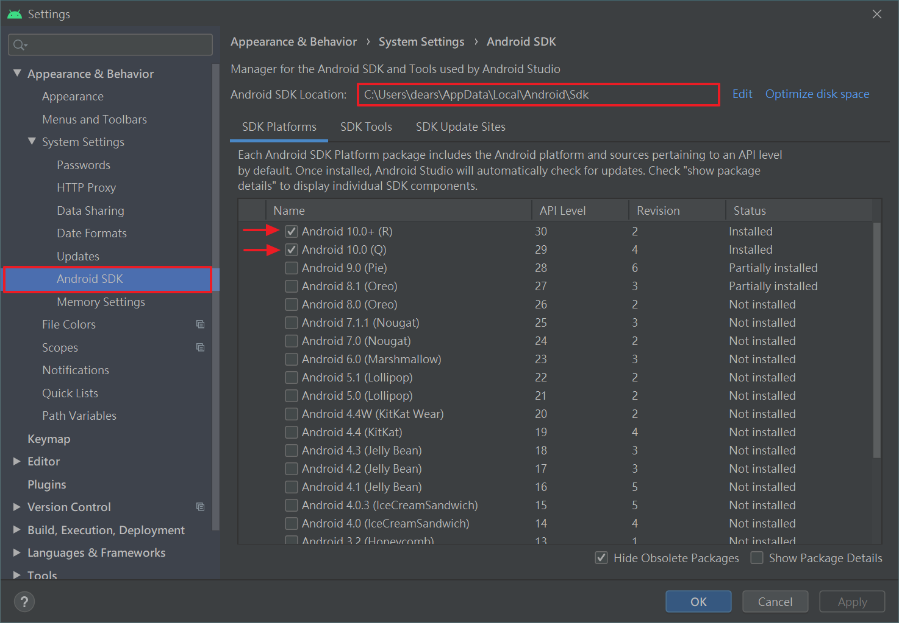
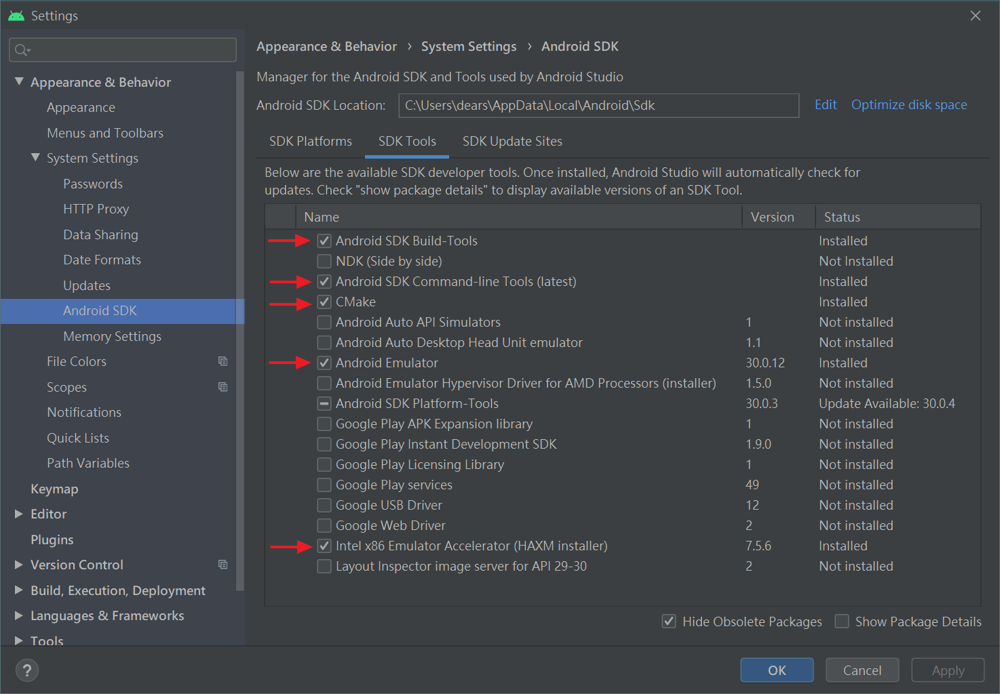
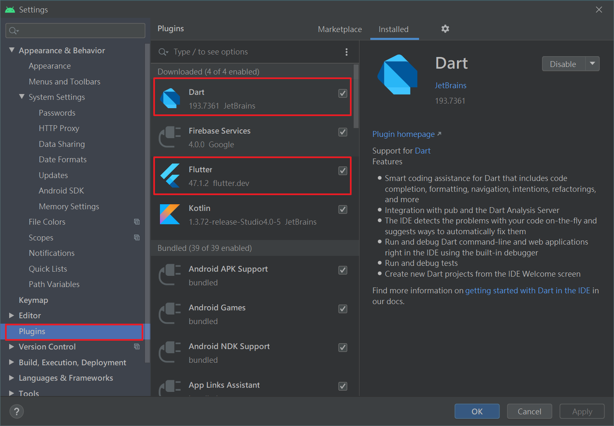
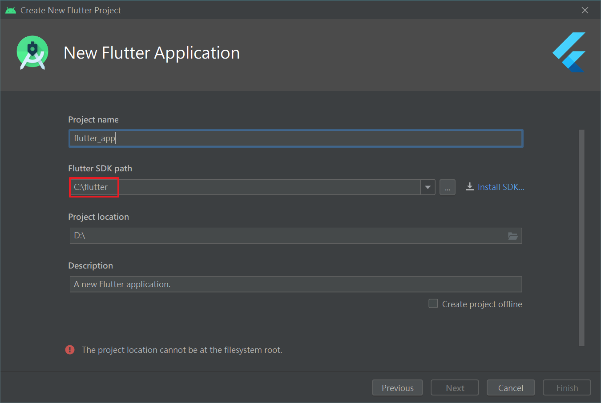
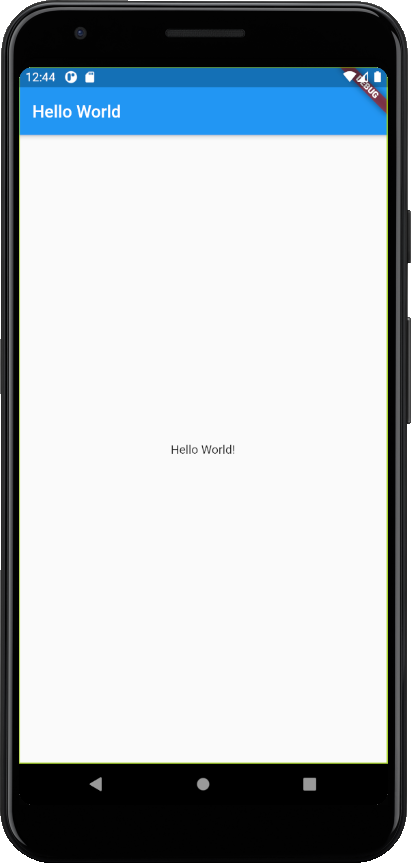

# Ch02- Flutter开发环境的搭建

> 目标: 让同学们学会搭建一个前端熟悉的Flutter开发环境。

## Note

### 2-1 Flutter开发环境的安装 -1
#### Flutter 开发环境的搭建
1. 系统基本要求
  * OS: win7, 64bits
  * Disk: 3G-5G
<br>

1. JAVA 环境安装
  * Download: [Java SE Development Kit 8 Downloads](https://www.oracle.com/java/technologies/javase/javase-jdk8-downloads.html)
  * Setup to C disk
  * win + R
  * enter `java`
<br>

3. Flutter SDK 的安装

* Download: [Flutter SDK releases](https://flutter.dev/docs/development/tools/sdk/releases#windows)
* 配置環境變量 `/flutter/bin`
* iOS-cmd:
  * `chsh -s /bin/zsh`
  * `cd /Library/flutter`
  * `export PATH=$PATH:/Library/flutter/bin`
  // install
  * `sudo xcodebuild -license`
  * `sudo xcodebuild -runFirstLaunch`
  * `sudo gem install cocoapods`
* win + R
* enter `flutter doctor`

* [iOS 工程師的 Flutter 踩坑筆記 — 開發環境建置_medium_潔客幫Jackercleaning_2019](https://medium.com/@jackercleaninglab/ios-工程師的-flutter-踩坑筆記-開發環境建置-e9ac19e95c96)
<br>

--

### 2-2 Flutter开发环境的安装 -2
#### Flutter 开发环境的搭建
1. Android Studio 的介绍和安装
  * Download: [Android Studio](https://developer.android.com/studio)
<br>

2. Dart 和 Flutter 开发插件的安装
  * 打开 Android Studio
  * 出现 **Search in repositories** 时点击进入
  * 安装 Flutter 会自动安装 Dart 插件
    * Flutter
    * Dart
<br>

3. Android 证书的安装
  * win + R
  * enter `--android-licenses`
<br>

||
|:---:|
|androidSetUp-1|
||
|androidSetUp-2|
||
|androidSetUp-3|
||
|androidSetUp-4|


--


### 2-3 AVD 虚拟机的建立
1. 新建一個Flutter 項目
  * 打开 Android Studio, 選擇 **Start a new Flutter project**
  * 再次選擇 **Flutter Application**, 需要等待一會
<br>

2. AVD 虚拟机的安装
  * 打開 **tool菜單**, 執行 **AVD Manager** 選項
<br>

--

### 2-4 VSCode 中搭建 Flutter 开发环境
#### VSCode 中搭建开发环境
1. 在 VSCode 中安裝 Flutter 和 Dart 插件
2. VSCode 中如何安裝和啟動虛擬機
3. VSCode 中新建 Flutter 項目並運行
  * Terminal:
    * `flutter create projectName`
    * `cd projectName`
    * `flutter run`

  ```Dart
  import 'package:flutter/material.dart';

  void main() {
    runApp(MyApp());
  }

  class MyApp extends StatelessWidget {
    // This widget is the root of your application.
    @override
    Widget build(BuildContext context) {
      return MaterialApp(
        title: 'Flutter Demo',
        theme: ThemeData(
          primarySwatch: Colors.blue,
          visualDensity: VisualDensity.adaptivePlatformDensity,
        ),
        home: MyHomePage(title: 'Flutter Demo Home Page'),
      );
    }
  }

  class MyHomePage extends StatefulWidget {
    MyHomePage({Key key, this.title}) : super(key: key);

    final String title;

    @override
    _MyHomePageState createState() => _MyHomePageState();
  }

  class _MyHomePageState extends State<MyHomePage> {
    int _counter = 0;

    void _incrementCounter() {
      setState(() {
        _counter++;
      });
    }

    @override
    Widget build(BuildContext context) {
      return Scaffold(
        appBar: AppBar(
          title: Text(widget.title),
        ),
        body: Center(
          child: Column(
            mainAxisAlignment: MainAxisAlignment.center,
            children: <Widget>[
              Text(
                'You have pushed the button this many times:',
              ),
              Text(
                '$_counter',
                style: Theme.of(context).textTheme.headline4,
              ),
            ],
          ),
        ),
        floatingActionButton: FloatingActionButton(
          onPressed: _incrementCounter,
          tooltip: 'Increment',
          child: Icon(Icons.add),
        ),
      );
    }
  }
  ```
  <br>

--

### 2-5 手把手教你写一个 HelloWorld 程序
##### Code: [helloProject](heloProject)
####　写一个 HelloWorld 程序
1. 手把手帶大家写一个 HelloWorld 程序
    ```Dart
    import 'package:flutter/material.dart';
    // 引入樣式包，基礎樣式。 material.dart

    void main() => runApp(MyApp());
    // runAPP() 執行App

    //繼承靜態組件
    class MyApp extends StatelessWidget {
      // 重寫
      @override
      Widget build(BuildContext context) {
        return MaterialApp(
            title: 'Welcome to Flutter',
            home: Scaffold(
                // 上面的藍條
                appBar: AppBar(
                  title: Text('Hello World'),
                ),
                body: Center(
                  child: Text('Hello World!'),
                )));
      }
    }
    ```

|  |
|:-----------------------:|
|       Hello World       |
<br>

2. StatefulWidget (靜態) 和　StatelessWidget (動態) 區別
3. VSCode 中常用快捷鍵和熱加載

| 快捷鍵 | 功能                                |
|-------|-----------------------------------|
| R 鍵   | 點擊後熱加載, 直接查看預覽效果.     |
| P 鍵   | 在虛擬機中顯示網格, 工作中經常使用. |
| O 鍵   | 切換 Android 和 iOS 的預覽模式      |
| Q 鍵   | 退出調試預覽模式                    |


#### 升級 Flutter SDK
1. Terminal: `flutter upgrade`
2. 刪除 SDK 包重新下載

