# Ch03- Flutter 常用组件的讲解

> 目标: 为后面能做出电影推荐 Demo 作基本铺垫

### 3-1 TextWidget 文本组件讲解

##### Code: [3-1 underLine\helloProject](3-1 underLine/heloProject)

#### TextWidget 文本组件

1. 手把手使用一个最簡單的 TextWidget
   > Flutter **一切皆組件**

<br>

2.  TextWidget 常用屬性


    | 屬性      | 功能               |
    |-----------|------------------|
    | TextAlign | 文本對齊           |
    | maxLines  | 文本顯示的最大行數 |
    | overflow  | 控制文本的溢出效果 |

    <br>

- 內容對齊

  ```dart
  textAlign: TextAlign.center
  textAlign: TextAlign.left
  textAlign: TextAlign.right
  textAlign: TextAlign.start
  textAlign: TextAlign.end
  ```

  <br>

- 內容顯示最大行數

  ```dart
  maxLines: 1
  maxLines: 2
  maxLines: 3
  ```

  <br>

- 內容顯示行數方式
  ```dart
  overflow: TextOverflow.clip
  overflow: TextOverflow.ellipsis // 雙點 ..
  overflow: TextOverflow.fade　　// 漸層
  ```
  <br>

| 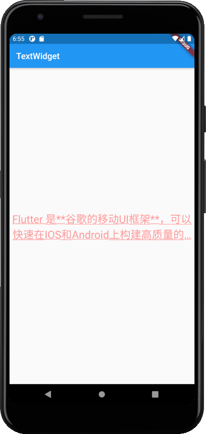 |
| :---------------------------------------------: |
|                    UnderLine                    |

<br>

##### 3. Style 屬性的用法, 讓文本漂亮起來.

- 字體大小, 數值設定 **小數點第一位**
- 文字顏色
  ```Dart
  style: TextStyle(
    fontSize: 25.0,
    color: Color.fromARGB(255, 255, 150, 150)
  )
  ```
  <br>

* 內容下滑線
  ```Dart
  decoration: TextDecoration.underline  // 底線
  decoration: TextDecoration.lineThrough　　// 劃過、貫穿文字
  //樣式
  decorationStyle: TextDecorationStyle.solid  // 實線
  decorationStyle: TextDecorationStyle.dotted　　// ......
  decorationStyle: TextDecorationStyle.dashed   // _ _ _ _
  decorationStyle: TextDecorationStyle.wavy     // 波浪
  ```
  <br>

--

### 3-2 ContainerWidget 容器组件讲解 -1

##### Code: [3-2 container\helloProject](3-2container/heloProject)

#### Container 容器组件

1. 如何興建容器組件

   ```Dart
   @override
   Widget build(BuildContext context) {
     return MaterialApp(
         title: 'TextWidget',
         home: Scaffold(
             appBar: AppBar(
               title: Text('TextWidget'),
             ),
             body: Center(
                 child: Container(
                     child: new Text(
                       'Hello Imooc',
                       style: TextStyle(fontSize: 40.0)
                     ),
                     alignment: Alignment.bottomRight
                 )
             )
         )
     );
   ```

2. Alignment 屬性的使用

- 有 9 種對齊方式
- 內容對齊

  ```dart
  alignment: Alignment.bottomCenter
  alignment: Alignment.bottomLeft
  alignment: Alignment.bottomRight
  alignment: Alignment.center
  alignment: Alignment.centerLeft
  alignment: Alignment.centerRight
  alignment: Alignment.topCenter
  alignment: Alignment.topLeft
  alignment: Alignment.topRight
  ```

  <br>

3. 設置寬高和顏色
   ```dart
   @override
   Widget build(BuildContext context) {
     return MaterialApp(
         title: 'TextWidget',
         home: Scaffold(
             appBar: AppBar(
               title: Text('TextWidget'),
             ),
             body: Center(
                 child: Container(
                   child: new Text(
                     'Hello Imooc',
                     style: TextStyle(
                       fontSize: 40.0
                     )
                   ),
                 alignment: Alignment.bottomRight,
                 width: 300.0,
                 height: 300.0,
                 color: Colors.lightBlue,
             ))));
   }
   ```

| 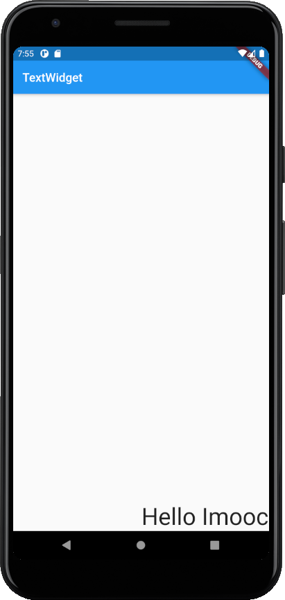 | 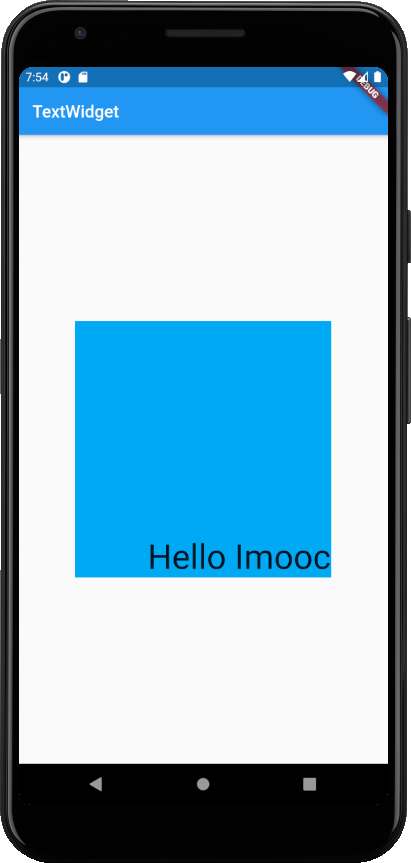 |
| :---------------------------: | :---------------------------------------: |
|           cotainer            |              cotainer-color               |

<br>

--

### 3-3 ContainerWidget 容器组件讲解 -2

##### Code: [3-3 decoration\helloProject](3-3decoration/heloProject)

#### Container 容器组件

1. Padding 內邊距屬性的使用

- Edgelnsets.all(): 統一設置
- Edgelnsets.fromLTRB(value1, value2, value3, value4)

  ```dart
  @override
  Widget build(BuildContext context) {
    return MaterialApp(
      title: 'TextWidget',
      home: Scaffold(
        appBar: AppBar(
          title: Text('TextWidget'),
        ),
        body: Center(
          child: Container(
            child: new Text(
              'Hello Imooc',
              style: TextStyle(fontSize: 40.0)
            ),
            alignment: Alignment.bottomRight,
            width: 300.0,
            height: 300.0,
            color: Colors.lightBlue,
            padding: const EdgeInsets.all(30.0)  // padding-all
          )
        )
      )
    );
  }
  ```

  ```dart
  @override
  Widget build(BuildContext context) {
    return MaterialApp(
      title: 'TextWidget',
      home: Scaffold(
        appBar: AppBar(
          title: Text('TextWidget'),
        ),
        body: Center(
          child: Container(
            child: new Text(
              'Hello Imooc',
              style: TextStyle(fontSize: 40.0)
            ),
            alignment: Alignment.bottomRight,
            width: 300.0,
            height: 300.0,
            color: Colors.lightBlue,
            padding: const EdgeInsets.fromLTRB(0.0, 30.0, 60.0, 40.0)  // padding-fromLTRB
          )
        )
      )
    );
  }
  ```

| 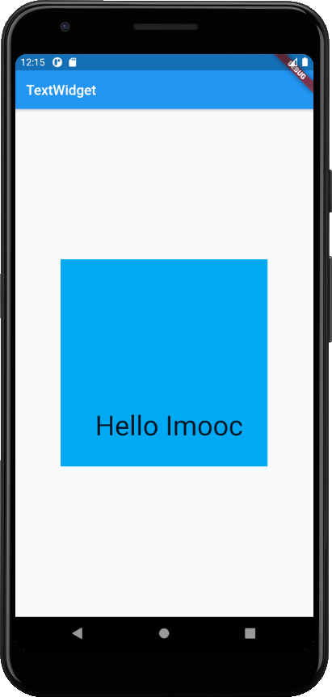 | 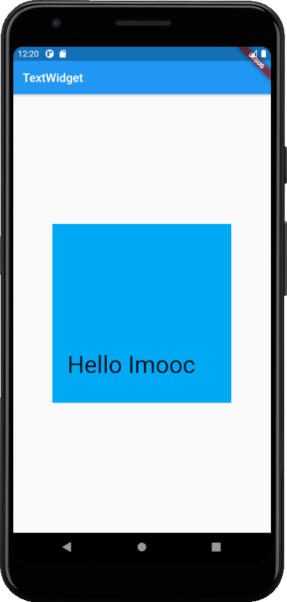 |
| :-------------------------------: | :-----------------------------------: |
|            padding-35             |             padding-ltrb              |

2. margin 外邊距屬性的使用

   ```dart
     @override
     Widget build(BuildContext context) {
       return MaterialApp(
         title: 'TextWidget',
         home: Scaffold(
           appBar: AppBar(
             title: Text('TextWidget'),
           ),
           body: Center(
             child: Container(
               child: new Text('Hello Imooc',
                 style: TextStyle(fontSize: 40.0)),
               alignment: Alignment.bottomRight,
               width: 300.0,
               height: 300.0,
               color: Colors.lightBlue,
               padding: const EdgeInsets.fromLTRB(0.0, 30.0, 60.0, 40.0),
               margin: const EdgeInsets.all(100.0)    // margin
             )
           )
         )
       );
     }
   ```

3. decoration 屬性制作彩色背景

- decoration 修飾器
  - 設置容器的邊框
  - BoxDecoration Widget 講解
  - LinearGradient 設置背景顏色漸變

> 任何屬性，也皆做組件使用。 **牢记：万物皆组件!**

```dart
@override
Widget build(BuildContext context) {
  return MaterialApp(
    title: 'TextWidget',
    home: Scaffold(
      appBar: AppBar(
        title: Text('TextWidget'),
      ),
      body: Center(
        child: Container(
          child: new Text('Hello Imooc',
            style: TextStyle(fontSize: 40.0)
          ),
          alignment: Alignment.bottomRight,
          width: 300.0,
          height: 300.0,
          // color: Colors.lightBlue,   　　　　要去掉，避免衝突
          padding: const EdgeInsets.fromLTRB(0.0, 30.0, 60.0, 40.0),
          margin: const EdgeInsets.all(100.0),
          decoration: new BoxDecoration(        //　修飾器
            gradient: const LinearGradient(　　　//　線性漸變
              colors: [　　　　//　三個顏色，以數組形式包裝
                Colors.lightBlue,
                Colors.greenAccent,
                Colors.purple
              ]
            )
          )
        )
      )
    )
  );
}
```

| 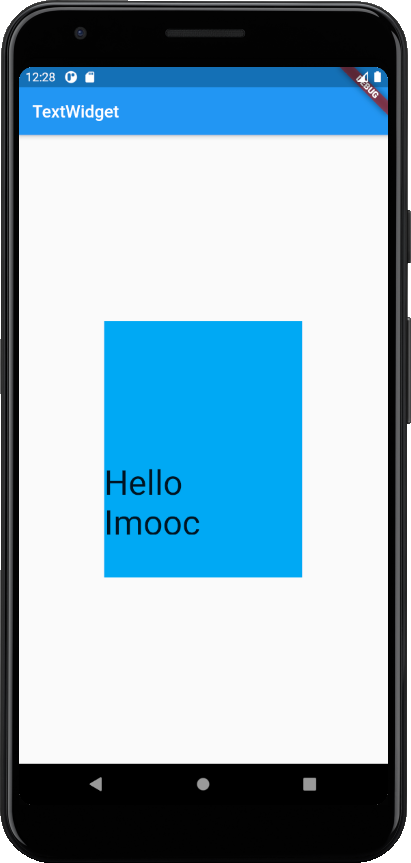 | 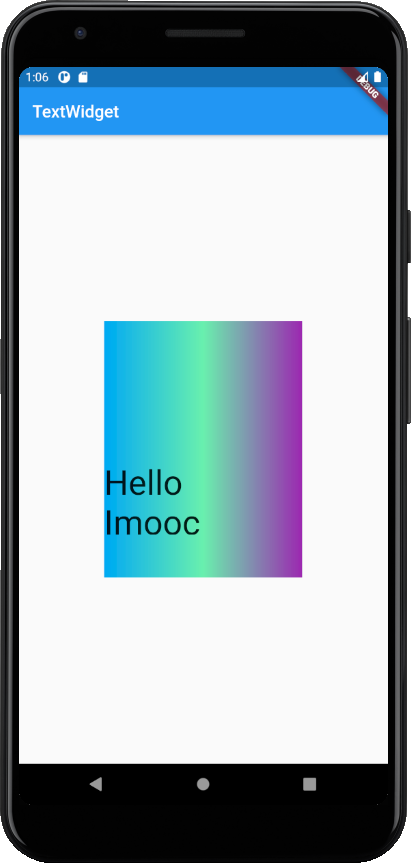 |
| :-----------------------: | :-------------------------------: |
|          margin           |            decoration             |

<br>

--

### 3-4 ImageWidget 图片组件讲解

##### Code: [3-4 ImageWidget\helloProject](3-3ImageWidget/heloProject)

#### Image 图片组件的使用

1. Image Widget 的幾種加入形式

- Image.asset 资源图片形式需慎用。
- Scale **值越大，图片越小**。

  | 形式          | 內容                                   |
  | ------------- | -------------------------------------- |
  | Image.asset   | 加载资源图片，会使打包时 App 包体过大  |
  | Image.network | 网络资源图片，经常替换的或者动态的图片 |
  | Image.file    | 本地图片，比如相机照相后的**图片预览** |
  | Image.memory  | 加载到内存中的图片，Uint8List (不常用) |

   <br>

```dart
@override
  Widget build(BuildContext context) {
    return MaterialApp(
      title: 'ImageWidget',
      home: Scaffold(
        appBar: AppBar(
          title: Text('ImageWidget'),
        ),
        body: Center(
          child: Container(
            child: new Image.network(
              // FIXME-ok: Can't run up the image.
              'https://images.unsplash.com/photo-1547721064-da6cfb341d50',
              scale: 2.0,
              fit: BoxFit.fill,
            ),
            width: 300.0,
            height: 200.0,
            color: Colors.lightBlue,
          ),
        )
    )
  );
}
```

<br>

2. Fit 屬性的詳細講解

- 圖片填滿容器
  - cover 最常用

```dart
fit: BoxFit.fill,      // 將圖片填充滿容器，圖片比例可能會因此變形
fit: BoxFit.contain,   // 維持圖片比例，將圖片填充滿容器的寬或高，可能會因容器大小，產生空隙
fit: BoxFit.cover,     // 維持圖片比例，將圖片填充滿容器，多餘的部分自動裁切，缺少的區塊自動拉長圖片填滿
fit: BoxFit.fitWidth,  // 維持圖片比例，將圖片填充滿容器的寬，多餘的部分自動裁切，缺少的區塊自動拉長圖片填滿
fit: BoxFit.fitHeight, // 維持圖片比例，將圖片填充滿容器的高，多餘的部分自動裁切，缺少的區塊自動拉長圖片填滿
fit: BoxFit.scaleDown, // 圖片大於容器，才有效果
```

|      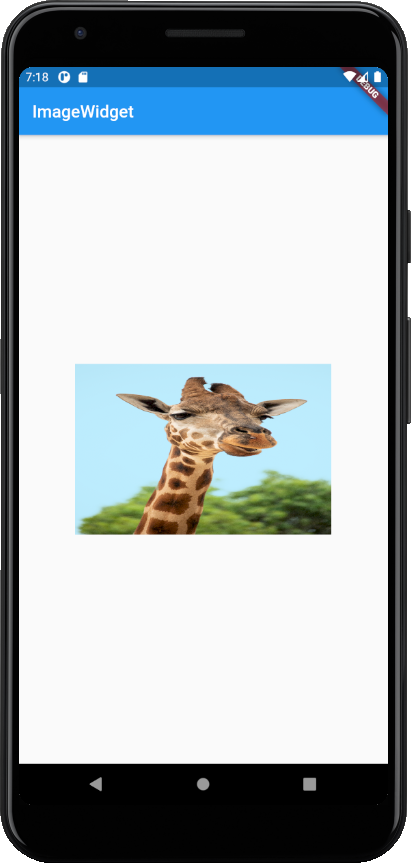      |    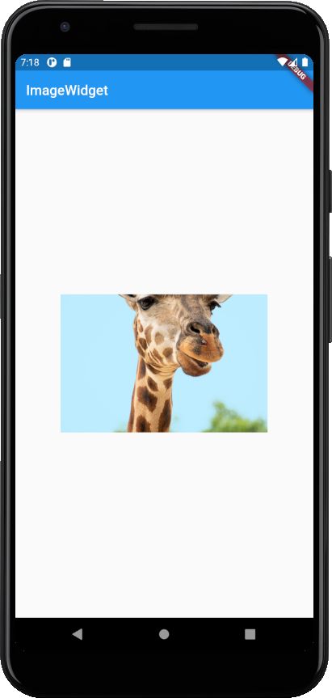    |
| :-------------------------------------------------------: | :-----------------------------------------------------: |
|                     image-widget-fill                     |                   image-widget-cover                    |
|   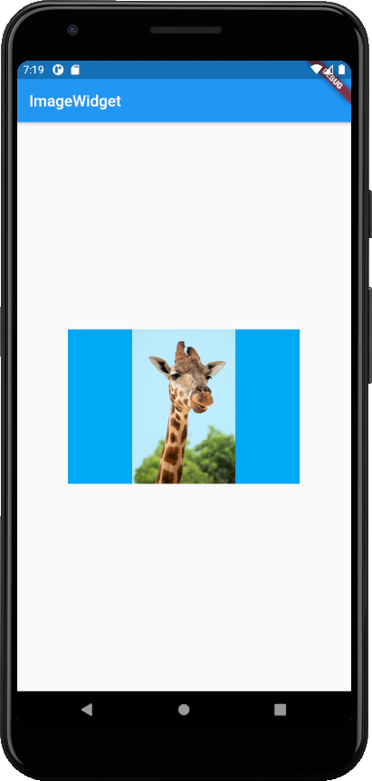   |  |
|                   image-widget-contain                    |                  image-widget-fitwidth                  |
|  |                            -                            |
|                  image-widget-fitheight                   |                            -                            |

<br>

3. 圖片的混和模式

- [Blend it Like… Anything!!\_medium_2018](https://medium.com/flutterpub/blend-it-like-anything-3fe67148f3f4)
- [Flutter: Blend Modes (Demo)\_youtube](https://www.youtube.com/watch?reload=9&v=u6Z4rXiSFg4)
- [Android Developer_BlendMode](https://developer.android.com/reference/android/graphics/BlendMode)
- [Flutter BlendMode 混合模式详解\_CSDN_2018](https://blog.csdn.net/chenlove1/article/details/84574237)

* [How To Display Images from Internet in Flutter?\_educity_flutter](https://educity.app/flutter/how-to-display-images-from-internet-in-flutter)

```dart
colorBlendMode: BlendMode.darken,
colorBlendMode: BlendMode.modulate,
colorBlendMode: BlendMode.difference,
colorBlendMode: BlendMode.screen,
```

```dart
 @override
  Widget build(BuildContext context) {
    return MaterialApp(
      title: 'ImageWidget',
      home: Scaffold(
        appBar: AppBar(
          title: Text('ImageWidget'),
        ),
        body: Center(
          child: Container(
            child: new Image.network(
              // FIXME-ok: Can't run up the image.
              'https://images.unsplash.com/photo-1547721064-da6cfb341d50',
              scale: 2.0,
              // fit: BoxFit.cover,
              color: Colors.greenAccent,          // 圖片的混和模式
              colorBlendMode: BlendMode.modulate,   // 圖片的混和模式
            ),
            width: 300.0,
            height: 200.0,
            color: Colors.lightBlue,
          ),
        )
      )
    );
  }
```

|     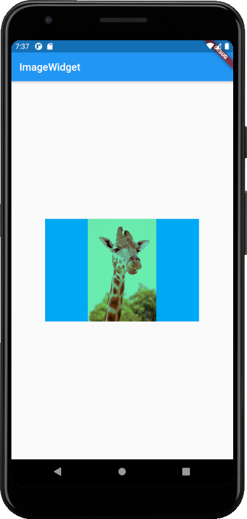     |  |
| :---------------------------------------------------------: | :-----------------------------------------------------: |
|                     image-widget-darken                     |                  image-widget-modulate                  |
| 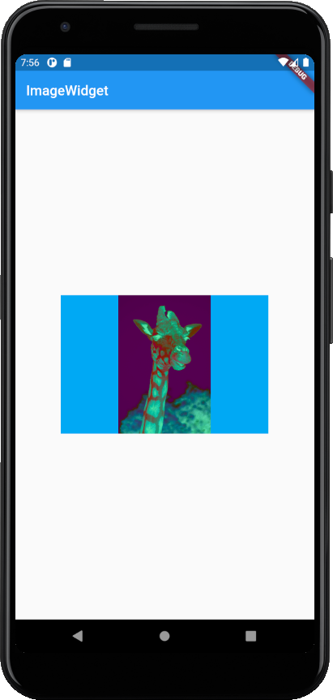 |   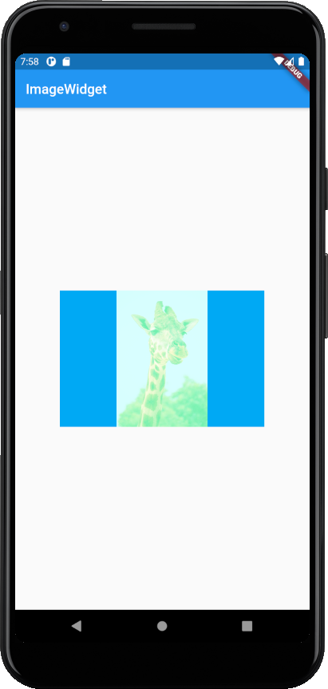   |
|                   image-widget-difference                   |                   image-widget-screen                   |

<br>

4. Repeat 屬性讓圖片重複

```dart
repeat: ImageRepeat.repeat,
repeat: ImageRepeat.repeatX,    // 橫向充滿
repeat: ImageRepeat.repeatY,    // 縱向充滿
```

| 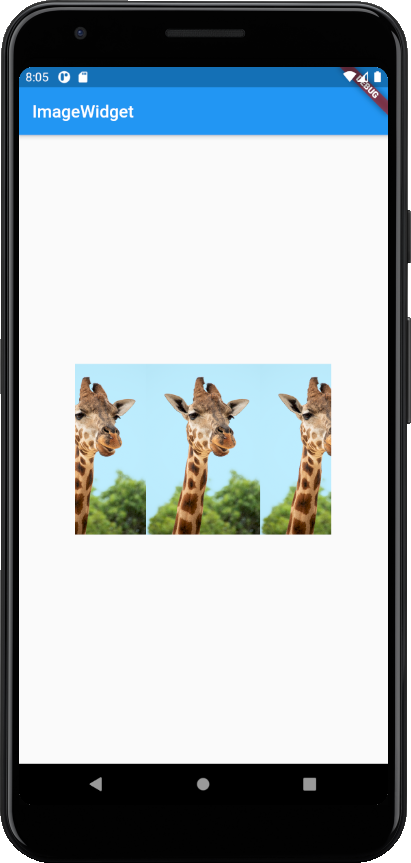 |
| :-------------------------------------------------: |
|                 image-widget-repeat                 |

<br>

##### ImageWidget 属性：

| 功能           | 內容                     |
| -------------- | ------------------------ |
| scale          | 缩放（值越大，图片越小） |
| fit            | 显示属性（拉伸、填充、宽 | 高对齐） |
| colorBlendMode | 叠加模式                 |
| repeat         | 重复                     |

##### 图片加载模式：

| 功能          | 內容     |
| ------------- | -------- |
| Image.asset   | 资源加载 |
| Image.network | 网络加载 |
| Image.file    | 本地加载 |
| Image.memory  | 内存加载 |

<br>

--

### 3-5 ListViewWidget 列表组件讲解

##### Code: [3-5 ListViewWidget\helloProject](3-5ListViewWidget/heloProject)

#### ListView 组件的使用

- 基本 Flutter 框架

```dart
import 'package:flutter/material.dart';

void main() => runApp(MyApp());

class MyApp extends StatelessWidget {
  @override
  Widget build(BuildContext context) {
    return MaterialApp(
      title: 'IMooc Flutter Demo',
      home: Scaffold(
        appBar: new AppBar(
          title: new Text('ListView Widget'),
        ),
        body: new Text('LestView'),
      ),
    );
  }
}
```

<br>

1. ListView 组件的語法講解

```dart
@override
  Widget build(BuildContext context) {
    return MaterialApp(
      title: 'IMooc Flutter Demo',
      home: Scaffold(
        appBar: new AppBar(
          title: new Text('ListView Widget'),
        ),
        body: new ListView(children: <Widget>[
          new ListTile(
            leading: new Icon(Icons.favorite),
            title: new Text('favorite'),
          ),           // 列表組件，返回一個數組
        ]),
      ),
    );
  }
```

- [flutter-material-icons](https://material.io/resources/icons/?icon=donut_large&style=baseline)
- [flutter-Icons class-Demo](https://api.flutter.dev/flutter/material/Icons-class.html)
- [flutter-club-book-3.5 图片及 ICON](https://book.flutterchina.club/chapter3/img_and_icon.html)

```dart
new ListTile(
  leading: new Icon(Icons.favorite),
  title: new Text('favorite'),
), // 列表組件，返回一個數組
new ListTile(
  leading: new Icon(Icons.audiotrack),
  title: new Text('audiotrack'),
),
new ListTile(
  leading: new Icon(Icons.beach_access),
  title: new Text('beach_access'),
),
new ListTile(
  leading: new Icon(Icons.android),
  title: new Text('android'),
),
```

<br>

2. ListTile 的使用

```dart
@override
  Widget build(BuildContext context) {
    return MaterialApp(
      title: 'IMooc Flutter Demo',
      home: Scaffold(
        appBar: new AppBar(
          title: new Text('ListView Widget'),
        ),
        body: new ListView(children: <Widget>[
          new ListTile(
            leading: new Icon(Icons.favorite),
            title: new Text('favorite'),
          ), // 列表組件，返回一個數組
          new ListTile(
            leading: new Icon(Icons.audiotrack),
            title: new Text('audiotrack'),
          ),
          new ListTile(
            leading: new Icon(Icons.beach_access),
            title: new Text('beach_access'),
          ),
          new ListTile(
            leading: new Icon(Icons.android),
            title: new Text('android'),
          ),
        ]),
      ),
    );
  }
```

<br>

3. 小實例 做一個圖片列表

```dart
@override
  Widget build(BuildContext context) {
    return MaterialApp(
      title: 'IMooc Flutter Demo',
      home: Scaffold(
        appBar: new AppBar(
          title: new Text('ListView Widget'),
        ),
        body: new ListView(children: <Widget>[
          new Image.network(
              'https://n.sinaimg.cn/transform/20141121/avxeafr4995788.jpg'),
          new Image.network(
              'https://i.ytimg.com/vi/7g_zGtH13LY/maxresdefault.jpg'),
          new Image.network('https://i.imgur.com/XoBbu9D.jpg'),
          new Image.network(
              'https://jefferic.files.wordpress.com/2015/03/penguins-of-madagascar.jpg'),
        ]),
      ),
    );
  }
```

| 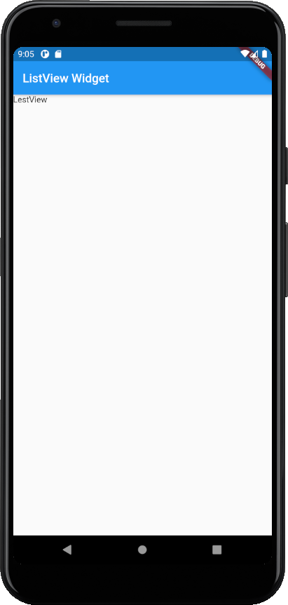 | 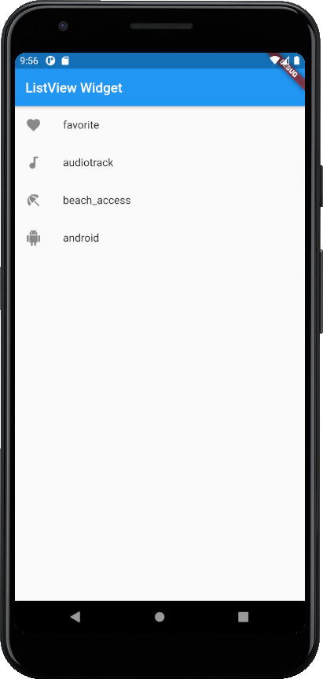 |  |
| :---------------------------: | :-------------------------------------: | :-----------------------------------------: |
|           listView            |              listView-icon              |               listView-images               |

--

### 3-6 横向列表和自定义组件讲解

##### Code: [3-6 ListViewWidget2\helloProject](3-6ListViewWidget2/heloProject)

#### 横向列表的使用

1. 製作橫向列表, 小例子

```dart
@override
  Widget build(BuildContext context) {
    return MaterialApp(
      title: 'IMooc Flutter Demo',
      home: Scaffold(
        appBar: new AppBar(
          title: new Text('ListView Widget'),
        ),
        body: Center(
          child: Container(
            height: 200.0,
            child: new ListView(
              scrollDirection: Axis.horizontal,
              children: <Widget>[
                new Container(
                  width: 180.0,
                  color: Colors.lightBlue,
                ),
                new Container(
                  width: 180.0,
                  color: Colors.amber,
                ),
                new Container(
                  width: 180.0,
                  color: Colors.deepOrange,
                ),
                new Container(
                  width: 180.0,
                  color: Colors.deepPurpleAccent,
                )
              ],
            ),
          ),
        )
      )
    );
  }
```

<br>

2. scrollDirection 屬性的講解

- Axis.horizontal: 橫向滾動或者叫水平方向滾動
- Axis.vertical: 縱向滾動或者叫垂直方向滾動
  <br>

3. 代碼的優化, 自訂義組件

- 優化代碼 - 製作獨立組件
- 實際操作, 觀看視頻

* 嵌套的方式顯得代碼混砸，可以嘗試分開的方式，劃分代碼，方便大項目的開發及代碼閱覽。

```dart
import 'package:flutter/material.dart';

void main() => runApp(MyApp());

class MyApp extends StatelessWidget {
  @override
  Widget build(BuildContext context) {
    return MaterialApp(
      title: 'IMooc Flutter Demo',
      home: Scaffold(
        appBar: new AppBar(
          title: new Text('ListView Widget'),
        ),
        body: Center(
          child: Container(height: 200.0, child: MyList()),
        )
      )
    );
  }
}

class MyList extends StatelessWidget {
  @override
  Widget build(BuildContext context) {
    return ListView(
      scrollDirection: Axis.horizontal,
      children: <Widget>[
        new Container(
          width: 180.0,
          color: Colors.lightBlue,
        ),
        new Container(
          width: 180.0,
          color: Colors.amber,
        ),
        new Container(
          width: 180.0,
          color: Colors.deepOrange,
        ),
        new Container(
          width: 180.0,
          color: Colors.deepPurpleAccent,
        )
      ],
    );
  }
}
```

| 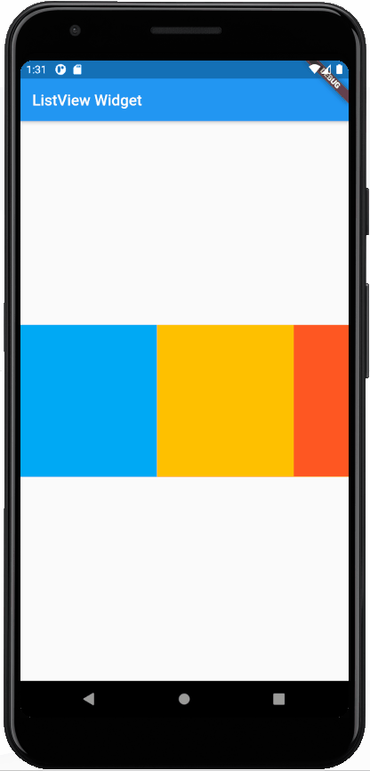 |
| :---------------------------------------------: |
|                listView-images-4                |

<br>

--

### 3-7 动态列表的使用

##### Code: [3-7 ListString\helloProject](3-7ListString/heloProject)

#### 动态列表的使用

1. Dart 中 List 類型的使用

- List 類型簡介, 可以簡單理解為 js 中的數組
- 聲明 List 的 4 種方式

```dart
void main() => runApp(MyApp(
  items: new List()          // List() 什麼都不加, 非固定長度
  items: new List(3)         // List() 加數字, 固定字符長度
  items: new List<String>()  // 規定以字串形式傳遞
  items: [1, 2, 3, 4, 5]     // 直接賦值
));
```

<br>

2. 傳遞和接受參數,實現動態列表基礎

- 如何傳遞參數
- 如何接受參數
<br>

3. 動態列表案例製作

```dart
import 'package:flutter/material.dart';

void main() =>
    runApp(MyApp(items: new List<String>.generate(20, (i) => 'Item $i')));

class MyApp extends StatelessWidget {
  final List<String> items;

  MyApp({Key key, @required this.items}) : super(key: key);

  @override
  Widget build(BuildContext context) {
    return MaterialApp(
        title: 'IMooc Flutter Demo',
        home: Scaffold(
            appBar: new AppBar(
              title: new Text('ListView Widget'),
            ),
            body: new ListView.builder(
                itemCount: items.length,
                itemBuilder: (context, index) {
                  return new ListTile(title: new Text('${items[index]}'));
                })));
  }
}
```

| 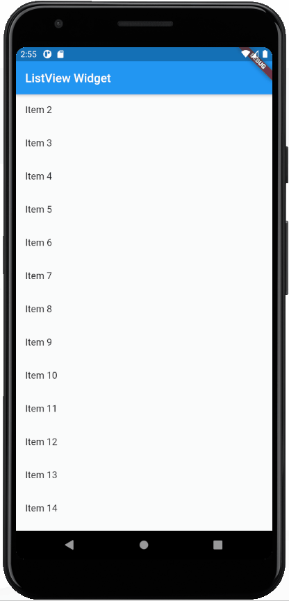 |
| :-------------------------------: |
|            list-items             |


#### Other Info.
* [初探 Flutter ：使用單一程式碼輕鬆建立 iOS 及 Android App！](https://www.appcoda.com.tw/flutter-basics/)
* [【Flutter基礎概念與實作】 Day7–Flutter Basic Widgets](https://ithelp.ithome.com.tw/articles/10215654)